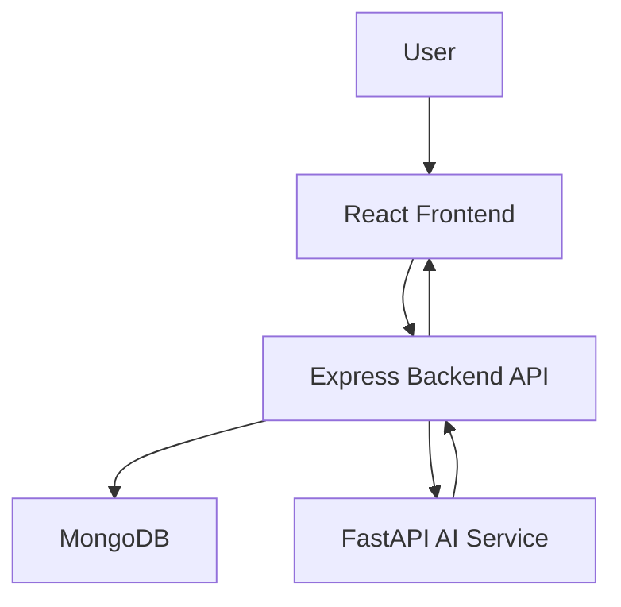
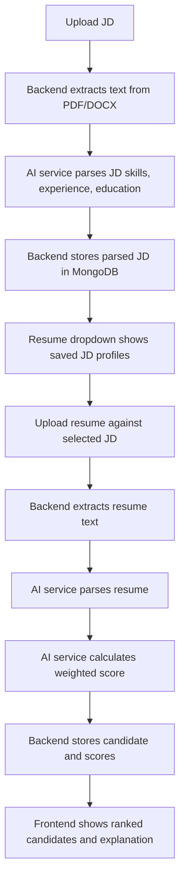

# AI Resume Screening System - Frontend and Backend

This folder contains the MERN application for the Resume Screening System assignment:

- `frontend/`: React + Vite UI
- `backend/`: Express + MongoDB API

The system lets users upload job descriptions, upload resumes against a selected JD, view parsed resume/JD data, and see a weighted AI match score with an explanation.

## Assignment Scope

The assignment asks for a resume screening system that:

1. Accepts resume text or resume files.
2. Extracts key candidate information.
3. Matches candidates against job requirements.
4. Returns a match score with an explanation.
5. Provides a simple frontend for upload, extracted data, and score review.
6. Includes documentation, Docker support, architecture explanation, sample data, and bug-fix notes.

## Current Architecture



## Data Flow



## Features

- Upload JD files.
- Store parsed JD profiles in MongoDB.
- Display all saved JDs with parsed details.
- Upload resume files against an existing JD.
- Parse candidate name, email, phone, skills, experience, education, job titles, and projects.
- Calculate weighted match score:
  - Skills: 45%
  - Experience: 20%
  - Project Relevance: 25%
  - Education: 10%
- Show ranked candidates.
- Show parsed resume data in collapsible cards.
- Show missing skills, score breakdown, and topic-wise AI explanation.
- Docker support for frontend, backend, AI service, and MongoDB.

## Backend API

Base URL:

```text
http://localhost:5000/api
```

### JD APIs

```http
POST /api/jd/upload
```

Uploads and parses a job description file.

```http
GET /api/jd
```

Returns saved parsed JD profiles from MongoDB.

### Resume APIs

```http
POST /api/resume/upload
```

Uploads a resume file and analyzes it against the selected MongoDB JD.

### Candidate APIs

```http
GET /api/candidates
```

Lists parsed candidates sorted by score.

### Match APIs

```http
GET /api/match/:jobId
```

Ranks all candidates against a selected job.

## Assignment Endpoint Mapping

The assignment mentions:

```http
POST /api/parse-resume
POST /api/match
GET /api/candidates
```

In this implementation:

- Resume parsing is performed by the AI service through the backend upload flow.
- Matching is performed by the AI service through `/advanced-match`.
- The Express backend exposes candidate results through `/api/candidates`.

## Extracted Resume Fields

The system extracts:

- Name
- Email
- Phone
- Skills
- Years of experience
- Education
- Job titles
- Projects

## Frontend

The frontend supports:

- JD upload in the Jobs tab.
- Resume upload in the Dashboard tab.
- Existing JD selection from MongoDB.
- Parsed JD details.
- Parsed resume details.
- Ranked candidate dropdown cards.
- Weighted score breakdown.
- Topic-wise AI explanation.

## Local Setup

### Backend

```bash
cd code/backend
npm install
npm run dev
```

Backend runs on:

```text
http://localhost:5000
```

Create `code/backend/.env`:

```env
PORT=5000
MONGO_URI=mongodb://127.0.0.1:27017/resume-screening
AI_SERVICE_URL=http://localhost:8000
JWT_SECRET=supersecret
```

### Frontend

```bash
cd code/frontend
npm install
npm run dev
```

Frontend runs on:

```text
http://localhost:5173
```

Optional frontend env:

```env
VITE_API_URL=http://localhost:5000/api
```

## Docker

From the project root:

```bash
docker compose up --build
```

This starts:

- MongoDB on `localhost:27017`
- Express backend on `localhost:5000`
- FastAPI AI service on `localhost:8000`
- React frontend on `localhost:5173`

Stop:

```bash
docker compose down
```

Stop and remove persisted volumes:

```bash
docker compose down -v
```


## Bug Fix Documentation

### Bug 1: Experience Extraction

Original issue:

```python
re.search(r'(\d+) years', resume_text)
```

Problems:

- Misses `yrs`, `year`, `2+ years`, `2-4 years`, and uppercase text.
- Only returns the first match.
- Does not handle multiple experience mentions.

Fixed approach:

- Normalize text to lowercase.
- Support multiple patterns such as `years`, `yrs`, and `year`.
- Collect all detected values and return the maximum relevant experience.

### Bug 2: Skill Matching

Original issue:

```python
if skill in candidate_skills:
```

Problems:

- Exact string matching misses variations like `React.js` vs `React`.
- Case-sensitive comparison can fail.
- Division by zero occurs if required skills are empty.
- It cannot understand related skills.

Fixed approach:

- Normalize and expand skills.
- Use semantic matching with exact-match boost.
- Guard against empty required-skill lists.
- Return matched and missing skills.

### Bug 3: Duplicate Detection

Original issue:

```python
for i in range(len(candidates)):
    for j in range(len(candidates)):
```

Problems:

- Compares each candidate with itself.
- Adds duplicate pairs twice.
- Does not normalize emails.
- Runs in O(n²), which is inefficient.

Fixed approach:

- Use email as a unique MongoDB field.
- Check existing candidate by email before insert.
- Avoid storing duplicate candidates.

## Understanding Questions

### 1. Data flow from resume upload to match score

The user uploads a resume and selects a JD from MongoDB. The backend extracts text from the file, sends it to the AI service for parsing, sends parsed resume and JD data to the scoring engine, receives a weighted score and explanation, stores the candidate in MongoDB, and returns the result to the frontend.

### 2. Why exact string matching is not enough for skills

Exact matching fails on common variations such as `React`, `React.js`, `Node`, `Node.js`, `JS`, and `JavaScript`. It also cannot detect related or equivalent concepts. Semantic matching and normalization improve recall and make the score more realistic.

### 3. What happens if a resume is empty, 100 pages, or only images

- Empty resume: extraction returns mostly empty fields and the score should be low.
- 100-page resume: parsing may be slow and should ideally have file-size/page limits.
- Image-only resume: normal PDF text extraction may fail; OCR would be needed.

### 4. What breaks at 1 million resumes

At 1 million resumes, synchronous processing, simple Mongo queries, embedding calls, and frontend rendering can become bottlenecks. The system would need background queues, batch processing, pagination, indexes, caching, object storage, distributed workers, and monitoring.

### 5. Two examples where AI-generated code was wrong

1. Experience extraction used one narrow regex and missed real-world formats.
2. Duplicate detection compared each candidate with itself and duplicated duplicate-pairs.

